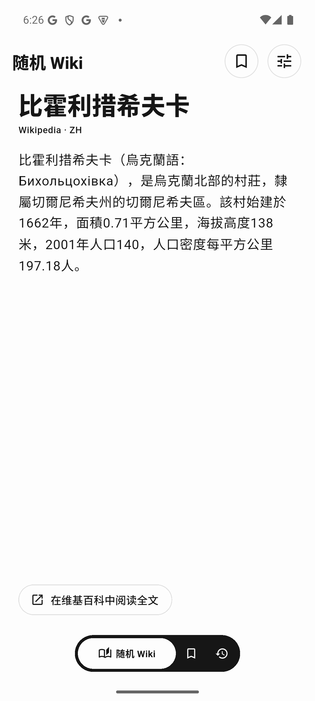
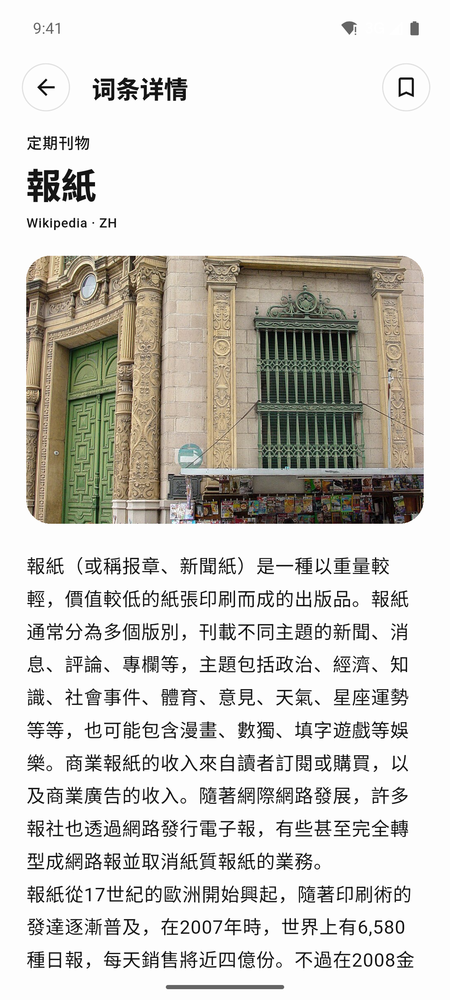

# Random Wiki

**简体中文** | [English](README.en.md)

上下滑刷随机维基百科词条。这不是维基媒体基金会的官方应用。

## 下载

- [直接下载（推荐，64 位手机）](https://github.com/maxilong258/random-wiki/releases/latest/download/random-wiki-arm64-v8a.apk)
- [所有版本与架构](https://github.com/maxilong258/random-wiki/releases)

Release 里的安装包带版本号，例如 `random-wiki-1.0.4-arm64-v8a.apk`：

- **arm64-v8a**：现在的手机几乎都用这个
- **armeabi-v7a**：较老的 32 位手机
- **x86_64**：电脑模拟器

安装未知来源 APK 时，按系统提示允许即可。Google Play 如已上架，也可以在商店搜索 **Random Wiki**。

## 截图

<p>
  
  
  
  
</p>

## 功能

- 上下滑切换随机词条
- 中文 / English 内容与界面
- 收藏、阅读历史
- 浅色、深色、跟随系统
- 打开维基百科原文

## 内容来源

词条文本和配图来自 [Wikipedia](https://www.wikipedia.org/)，按 [CC BY-SA](https://creativecommons.org/licenses/by-sa/4.0/) 授权。应用内会标明来源语言，例如 `Wikipedia · ZH`。

## 从源码运行

需要安装 [Flutter](https://flutter.dev/docs/get-started/install)。

```bash
git clone https://github.com/maxilong258/random-wiki.git
cd random-wiki
flutter pub get
flutter run
```

## 开源协议

[MIT](LICENSE)
